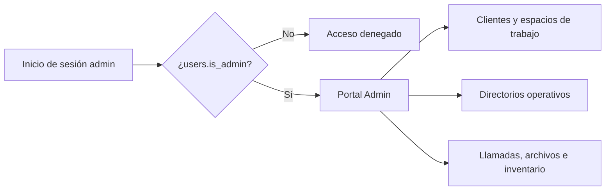

El Portal Admin es la aplicación de operaciones en `https://caimanlabs.com.mx/admin/`. Comparte PocketBase con el Portal de Clientes, pero solo permite acceso a usuarios con `users.is_admin = true`.

## Modelo de acceso



El hook de PocketBase impide que un usuario normal se promueva a sí mismo. Los administradores se asignan de forma deliberada; el navegador del Portal de Clientes nunca debe recibir credenciales de superusuario.

## Navegación y responsabilidades

| Sección | Información que puede consultar el administrador |
| --- | --- |
| Clientes | Resumen, plan, facturación, almacenamiento, estado y entrada al espacio de trabajo. |
| Usuarios | Cuentas reales que se autentican por correo/contraseña u OAuth. Un cliente podrá tener varios usuarios después. |
| Agentes | Agentes agrupados por cliente, con búsqueda, filtros, columnas y detalle. |
| Canales sociales | Canales agrupados por cliente, logos de plataforma y detalle de integraciones. |
| Llamadas | Citas de soporte agendadas por clientes. |
| Inventario | Primero clientes; después la misma tabla editable del Portal de Clientes. |
| Archivos | Primero clientes; después espacio completo de archivos con carga, búsqueda, selección y acciones. |
| Espacio de trabajo | Vista por cliente con breadcrumb, perfil, negocio, etapas, facturación y detalles permitidos. |

## Datos compartidos y configuración

Portal Admin no duplica la base de datos. Lee y actualiza las mismas colecciones de PocketBase bajo reglas `is_admin` donde corresponde.

- Cambios del cliente se reflejan en su espacio admin.
- Las citas creadas en Soporte aparecen en Llamadas.
- Inventario y archivos conservan definiciones y registros en ambos portales.
- El plan de implementación se obtiene de `integration_steps`, no se recrea en la UI admin.

Soporta español, inglés y portugués con una clave de idioma/sesión distinta a Client Portal. Para producción requiere:

```text
VITE_POCKETBASE_URL=https://api.caimanlabs.com.mx
base: "/admin/"
```

Usar la [Guía de Producción del Portal](./client-portal-production/) para el release conjunto.
