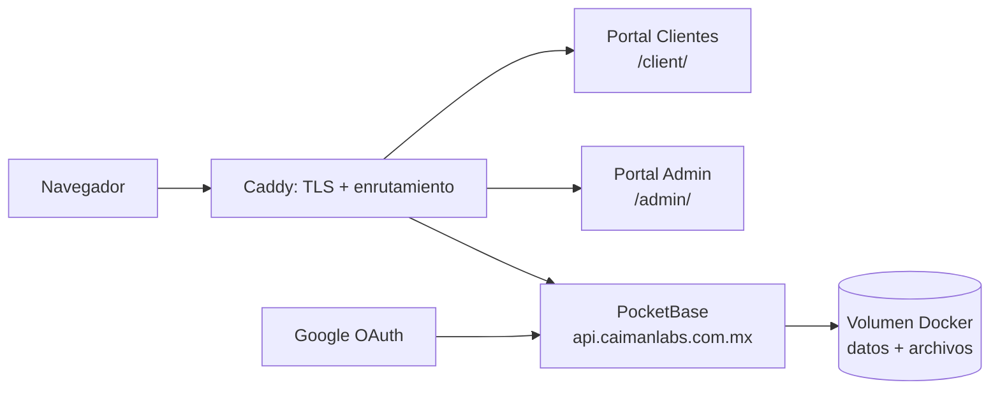

Esta es la guía de entrega para llevar el Portal de Clientes, Portal Admin, API y acceso con Google a producción. Usa una solución pequeña y autohospedada adecuada para la cantidad actual de clientes.

> **Alcance del despliegue:** un release contiene tres entregables: Portal de Clientes, Portal Admin y PocketBase. Desplegar solamente el Portal de Clientes está incompleto.

## Arquitectura objetivo

| Dirección pública | Servicio | Repositorio fuente |
| --- | --- | --- |
| `https://caimanlabs.com.mx/client/` | Portal de Clientes (build estático React/Vite) | `cAImanLabs-ClientPortal` |
| `https://caimanlabs.com.mx/admin/` | Portal Admin (build estático React/Vite) | `cAImanLabs-AdminPortal` |
| `https://api.caimanlabs.com.mx` | API, dashboard y archivos de PocketBase | `cAImanLabs-ClientPortal` (`Dockerfile`, `pb_migrations`, `pb_hooks`) |

El sitio corporativo puede seguir atendiendo `/`. Los portales deben montarse debajo de `/client/` y `/admin/`; no son dominios públicos independientes.



## Stack requerido

- **VPS OVH con Ubuntu 24.04**.
- **Docker Engine y plugin Docker Compose** para PocketBase y almacenamiento persistente.
- **Caddy 2** para proxy inverso, HTTPS automático y archivos estáticos.
- **PocketBase 0.39.10** como autenticación, base de datos, archivos, migraciones y hooks.
- **React 19 + Vite 8** solo durante el build; Caddy sirve los archivos generados.
- **Google OAuth 2.0 Web application** para acceso de clientes.
- **Deploy key de GitHub** de solo lectura para los repositorios.

No se necesita Kubernetes, base de datos administrada, Redis, PM2 ni hosting de pago para esta primera versión.

## Rutas del VPS

Crear como usuario `ubuntu`:

```text
/srv/caimanlabs/
├── client-portal/                 # clone: cAImanLabs-ClientPortal
├── admin-portal/                  # clone: cAImanLabs-AdminPortal
├── releases/
│   ├── client/                    # archivos compilados del Portal Clientes
│   └── admin/                     # archivos compilados del Portal Admin
├── pocketbase/                    # compose y .env de PocketBase
│   ├── compose.yml
│   └── backups/
└── caddy/
    └── Caddyfile
```

Usar un volumen Docker nombrado, por ejemplo `caimanlabs_pocketbase_data`, para `/pb/pb_data`. Contiene SQLite y todos los archivos de clientes; no se debe borrar.

## Preparación inicial

1. Apuntar los registros DNS de `caimanlabs.com.mx` y `api.caimanlabs.com.mx` a la IP del VPS OVH.
2. Instalar Docker Engine, el plugin Compose y Caddy 2.
3. Abrir solo `22`, `80` y `443` en OVH/UFW. No exponer el puerto `8090` de PocketBase.
4. Crear una deploy key de GitHub y clonar los repositorios en `/srv/caimanlabs/`.
5. Crear `/srv/caimanlabs/pocketbase/.env` con una clave `PB_ENCRYPTION_KEY` única de 32 caracteres y permisos `600`. Nunca guardarla en Git.

## Compose de PocketBase

Crear `/srv/caimanlabs/pocketbase/compose.yml`:

```yaml
services:
  pocketbase:
    build:
      context: ../client-portal
      dockerfile: Dockerfile
    restart: unless-stopped
    environment:
      PB_ENCRYPTION_KEY: ${PB_ENCRYPTION_KEY:?Set PB_ENCRYPTION_KEY in .env}
    ports:
      - "127.0.0.1:8090:8090"
    volumes:
      - caimanlabs_pocketbase_data:/pb/pb_data
      - ../client-portal/pb_hooks:/pb/pb_hooks:ro
      - ../client-portal/pb_migrations:/pb/pb_migrations:ro

volumes:
  caimanlabs_pocketbase_data:
```

Iniciar y comprobar localmente:

```bash
cd /srv/caimanlabs/pocketbase
docker compose -f compose.yml up -d --build
curl http://127.0.0.1:8090/api/health
```

Crear el primer superusuario dentro de **este mismo proyecto Compose**:

```bash
docker compose -f compose.yml exec pocketbase \
  /pb/pocketbase superuser upsert admin@caimanlabs.com.mx 'ELEGIR-UNA-CONTRASENA-LARGA-NUEVA'
```

## Caddy y rutas

Crear `/srv/caimanlabs/caddy/Caddyfile`. Conservar o adaptar el manejador existente de `/` del sitio corporativo.

```txt
caimanlabs.com.mx {
    encode zstd gzip

    redir /client /client/ 308
    handle_path /client/* {
        root * /srv/caimanlabs/releases/client
        try_files {path} /index.html
        file_server
    }

    redir /admin /admin/ 308
    handle_path /admin/* {
        root * /srv/caimanlabs/releases/admin
        try_files {path} /index.html
        file_server
    }

    handle {
        respond "El sitio corporativo se configura por separado" 404
    }
}

api.caimanlabs.com.mx {
    encode zstd gzip
    reverse_proxy 127.0.0.1:8090
}
```

Validar y recargar:

```bash
sudo caddy validate --config /srv/caimanlabs/caddy/Caddyfile
sudo systemctl reload caddy
```

## Build y publicación de los portales

Antes de compilar hay que definir el `base` de Vite. Es un cambio requerido: los dos portales se sirven debajo de una ruta.

```ts
// vite.config.ts del Portal Clientes
export default defineConfig({ base: "/client/" })

// vite.config.ts del Portal Admin
export default defineConfig({ base: "/admin/" })
```

Compilar ambos con la URL pública de la API:

```bash
cd /srv/caimanlabs/client-portal
printf 'VITE_POCKETBASE_URL=https://api.caimanlabs.com.mx\n' > .env.production.local
npm ci && npm run build
rsync -a --delete dist/ /srv/caimanlabs/releases/client/

cd /srv/caimanlabs/admin-portal
printf 'VITE_POCKETBASE_URL=https://api.caimanlabs.com.mx\n' > .env.production.local
npm ci && npm run build
rsync -a --delete dist/ /srv/caimanlabs/releases/admin/
```

`VITE_POCKETBASE_URL` es configuración pública. No incluir secretos de Google ni `PB_ENCRYPTION_KEY`.

### Orden obligatorio de release — ambos portales

Usar este orden en cada release para mantener compatibles la API, Portal Clientes y Portal Admin:

```bash
# 1. Actualizar ambos repositorios de aplicación.
git -C /srv/caimanlabs/client-portal pull --ff-only
git -C /srv/caimanlabs/admin-portal pull --ff-only

# 2. Aplicar migraciones y hooks de PocketBase desde Client Portal.
cd /srv/caimanlabs/pocketbase
docker compose -f compose.yml up -d --build

# 3. Compilar + publicar Portal Clientes en /client/.
cd /srv/caimanlabs/client-portal
npm ci && npm run build
rsync -a --delete dist/ /srv/caimanlabs/releases/client/

# 4. Compilar + publicar Portal Admin en /admin/.
cd /srv/caimanlabs/admin-portal
npm ci && npm run build
rsync -a --delete dist/ /srv/caimanlabs/releases/admin/

# 5. Activar rutas y verificar ambas URLs.
sudo systemctl reload caddy
```

El Portal Admin usa la misma instancia de PocketBase, pero es un frontend que se compila de forma independiente. También debe recibir `VITE_POCKETBASE_URL=https://api.caimanlabs.com.mx` y `base: "/admin/"`.

## Google OAuth

1. En Google Cloud Console crear un cliente OAuth tipo **Web application**.
2. Agregar esta URI de redirección autorizada:

   ```text
   https://api.caimanlabs.com.mx/api/oauth2-redirect
   ```

3. Agregar `https://caimanlabs.com.mx` como origen JavaScript autorizado.
4. En PocketBase ir a **Collections → users → engrane de la colección → OAuth2**, activar Google y guardar Client ID y Client Secret.
5. El frontend ya llama `pb.collection("users").authWithOAuth2({ provider: "google" })`.

### Decisión requerida: teléfono obligatorio

El campo `users.phone` es obligatorio. El primer acceso mediante Google fallará si no recibe un teléfono al crear el usuario. Antes de habilitarlo, agregar un paso corto para solicitar teléfono antes del botón Google y usar:

```ts
await pb.collection("users").authWithOAuth2({
  provider: "google",
  createData: { phone },
})
```

Al acceder correctamente, PocketBase crea el registro en `users`, por lo que aparece en la tabla de usuarios del Portal Admin. Los hooks existentes crean después los registros de negocio y onboarding.

## MCP de datos de clientes para agentes

El repositorio Client Portal contiene un servidor MCP local en `mcp/`. Es la única vía admitida para que un agente lea o publique datos de clientes; no se deben entregar al agente credenciales directas del dashboard de PocketBase ni acceso irrestricto a la base de datos.

Expone cinco herramientas limitadas:

- `list_clients` y `get_client_context` para contexto aprobado del cliente;
- `publish_client_information` para campos permitidos de perfil, información y sitio web;
- `publish_client_progress` para un paso existente de onboarding;
- `publish_client_file` para un archivo local aprobado.

El servidor funciona por **stdio** y no abre ningún puerto público. Instalarlo en el VPS y mantener privado su archivo de entorno:

```bash
cd /srv/caimanlabs/client-portal/mcp
npm ci
cp .env.example .env
chmod 600 .env
mkdir -p /srv/caimanlabs/mcp-uploads
```

Configurar en ese `.env` `MCP_POCKETBASE_URL=https://api.caimanlabs.com.mx`, un correo/contraseña de superusuario PocketBase dedicado y `MCP_UPLOAD_DIR=/srv/caimanlabs/mcp-uploads`. Configurar el host del agente para ejecutar `npm start` desde esa carpeta. MCP solo acepta archivos dentro de `MCP_UPLOAD_DIR`, no expone tokens OAuth y no permite consultas crudas a la base de datos.

## Checklist de despliegue

1. Actualizar los repositorios de **ambos** portales a los commits aprobados.
2. Respaldar PocketBase antes de aplicar migraciones.
3. Reconstruir PocketBase, compilar y sincronizar los dos portales.
4. Recargar Caddy.
5. Verificar:

   - `https://caimanlabs.com.mx/client/` y sus rutas internas al recargar;
   - `https://caimanlabs.com.mx/admin/` y sus rutas internas al recargar;
   - `https://api.caimanlabs.com.mx/_/` por HTTPS;
   - acceso con correo/contraseña y Google;
   - creación de usuario Google visible en Portal Admin;
   - persistencia de archivo de cliente después de reiniciar Compose.

## Respaldo y recuperación

Crear una copia diaria cifrada y fuera del VPS del volumen de PocketBase. Como mínimo copiar base de datos y archivos del volumen a `/srv/caimanlabs/pocketbase/backups/`, y replicar esa carpeta a almacenamiento independiente. Probar una restauración en un volumen que no sea producción antes de depender de ella.

El despliegue no está terminado hasta comprobar respaldo y restauración.
