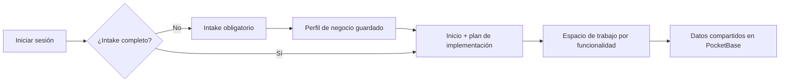

El Portal de Clientes es la aplicación para negocios en `https://caimanlabs.com.mx/client/`. Permite a cada usuario configurar su empresa, aportar contexto de implementación y dar seguimiento a la entrega.

## Flujo de usuario



1. El cliente inicia sesión con correo/contraseña o Google.
2. Un registro nuevo en `users` crea un `businesses`, facturación inicial y pasos de onboarding.
3. El intake es obligatorio; no hay navegación hasta guardar `intake_completed_at`.
4. Las funcionalidades elegidas determinan las secciones visibles.

## Secciones principales

| Sección | Propósito | Disponibilidad |
| --- | --- | --- |
| Inicio | Resumen de negocio, canales, estado de agentes/sitio y etapas pendientes. | Siempre después del intake |
| Progreso | Vista de plan primero, respaldada por `integration_steps`. | Siempre |
| Agentes | Estado de agentes WhatsApp Business, chat web, llamadas y generación multimedia. | Si se selecciona un agente |
| Social Media | Selección, conexión y contexto de canales activos. | `social_integration` |
| Sitio web | Requisitos estructurados según tipo de sitio. | `website` |
| Inventario | Catálogo editable, columnas personalizadas, variantes e importación/exportación CSV. | `catalog_sales` |
| Reservaciones | Recursos, precios, moneda y método de reserva configurables. | `reservations` |
| Imágenes y videos / Archivos | Carga de medios y archivos con propósito/sección. | Siempre |
| Información | Objetivos, misión, slogans, precios, referencias y módulos adicionales. | Siempre |
| Soporte | Contexto de soporte y programación de llamadas. | Siempre |
| Facturación | Plan, renovación, facturas e información de pago. | Siempre |
| Configuración | Perfil de usuario y controles separados de funcionalidades con confirmación al guardar. | Siempre |

## Navegación basada en funcionalidades

La barra lateral no es fija. `businesses.functionalities` controla menú y plan:

- `chat_agent`, `wa_business`, `phone_calls_agent` y `social_media_generation_agent` muestran **Agentes**.
- `social_integration` muestra **Social Media** y sus etapas.
- `website` muestra **Sitio web** y su demo.
- `catalog_sales` muestra **Inventario**.
- `reservations` muestra **Reservaciones**.
- `reports` agrega etapas de reportes.

Al quitar una funcionalidad se eliminan las secciones y etapas dependientes; no se exponen datos no relacionados.

## Autenticación e idioma

- PocketBase administra autenticación y el navegador guarda la sesión en una clave específica del Portal de Clientes.
- Google OAuth usa la colección `users`. Como `users.phone` es obligatorio, el flujo OAuth debe solicitar teléfono y enviarlo como `createData` antes de habilitar el alta por primera vez.
- Español, inglés y portugués se guardan localmente y se aplican al portal.

## Propiedad de datos y desarrollo local

Todo registro del cliente se vincula a un negocio. Las reglas de PocketBase limitan los registros normales a `business.owner = usuario autenticado`; la interfaz no es la barrera de seguridad.

```bash
cd cAImanLabs-ClientPortal
npm ci
npm run dev
```

Configurar `VITE_POCKETBASE_URL` con la instancia correspondiente. Para producción usar la [Guía de Producción del Portal](./client-portal-production/).
