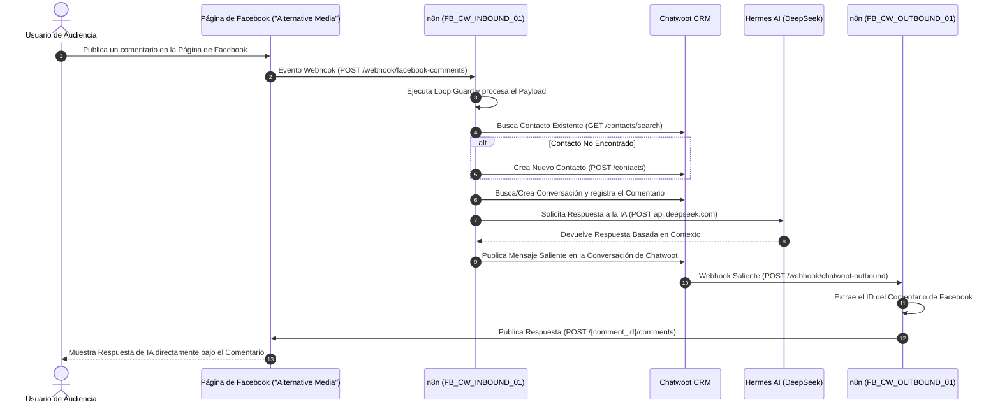

Este documento proporciona una visión general del sistema automatizado de cAIman Labs para publicación en redes sociales, atención al cliente con IA, gestión en CRM y orquestación mediante webhooks.

---

## 1. Componentes del Sistema y Dominios

| Servicio | Subdominio / URL | Namespace | Función Principal |
| :--- | :--- | :--- | :--- |
| **Postiz** | `https://app.caimanlabs.com.mx` | `postiz` | Plataforma multicanal de publicación y programación en redes sociales |
| **Chatwoot** | `https://chatwoot.11061996.xyz` | `chatwoot` | CRM centralizado de atención al cliente y soporte |
| **Motor n8n** | `https://api.caimanlabs.com.mx` | `api-operations` | Orquestación de eventos, transformación de webhooks y automatización |
| **Hermes AI** | `https://hermes.11061996.xyz` | `ai-agent` | Agente de IA impulsado por modelos DeepSeek LLM |
| **Páginas de Facebook** | `Graph API v20.0` | Externo | Canales sociales de audiencia (Página: `Alternative Media`) |

---

## 2. Flujo de Datos E2E

---

## 3. Topología de Red en Kubernetes

- **Controlador Ingress**: NGINX Ingress Controller enrutando tráfico HTTPS mediante certificados TLS.
- **Red Interna del Clúster**:
  - `n8n` se comunica con `Chatwoot` a través del DNS interno del clúster: `http://chatwoot-web.chatwoot:3000`.
  - `n8n` llama directamente a la API de `DeepSeek` sobre HTTPS (`https://api.deepseek.com/v1/chat/completions`).
  - `Postiz` se comunica con `postiz-postgres:5432`, `postiz-redis:6379` y `temporal:7233` dentro del namespace `postiz`.

---

## 4. Bóveda de Secretos y Seguridad

Todas las claves API, credenciales de base de datos, secretos JWT y tokens OAuth se almacenan de forma segura fuera del repositorio en la bóveda cifrada Cryptomator:
- **Ruta Montada**: `/Volumes/Environments-Keys`
- **Referencia Maestra**: `/Volumes/Environments-Keys/MASTER_ENVIRONMENT_KEYS.md`
