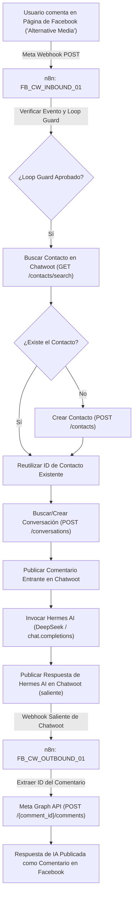

Este documento detalla la arquitectura end-to-end, configuración, flujos de trabajo n8n, integración con CRM Chatwoot y la integración del agente de IA Hermes para Páginas de Facebook.

---

## 1. Visión General de la Arquitectura

---

## 2. Metadatos de la App y Página de Facebook

- **Nombre de la App**: `Testing Postiz Working`
- **ID de la App**: `1462110212613281`
- **Modo de la App**: Desarrollo / Negocios
- **Página Objetivo**: `Alternative Media`
- **ID de la Página**: `107444744207055`
- **Campos Suscritos**: `feed`, `messages`, `ratings`
- **Endpoint Webhook**: `https://api.caimanlabs.com.mx/webhook/facebook-comments`
