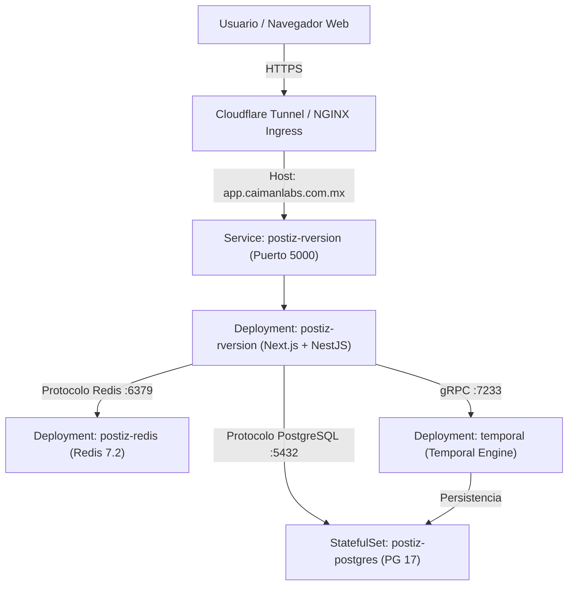

Este documento detalla la instalación, arquitectura de despliegue, configuración de contenedores, parches de host y configuración en Kubernetes para **Postiz**, la plataforma de gestión de redes sociales desplegada para cAIman Labs.

---

## 1. Visión General y Stack Tecnológico

**Postiz** es una aplicación auto-hospedada para programación y publicación en redes sociales. La instancia de cAIman Labs está desplegada en un namespace dedicado en Kubernetes (`postiz`) sobre un clúster OrbStack/K3s con enrutamiento de Ingress Cloudflare.

### Tecnologías Clave Utilizadas
- **Orquestación**: Kubernetes (`v1.30+`)
- **Backend / Interfaz Web**: Next.js & NestJS (`postiz-rversion:latest`)
- **Base de Datos**: PostgreSQL 17 Alpine (`StatefulSet` + 5Gi PVC)
- **Caché y Colas**: Redis 7.2 Alpine
- **Planificador de Tareas**: Temporal Workflow Engine (`temporalio/auto-setup:1.28.1`)
- **Controlador Ingress**: NGINX Ingress Controller + Cloudflare Tunnel
- **Endpoints de Dominio**: `https://app.caimanlabs.com.mx` / `https://postiz.11061996.xyz`

---

## 2. Diagrama de Arquitectura en Kubernetes



---

## 3. Instrucciones de Despliegue

1. Aplicar el manifiesto unificado de Kubernetes:
   ```bash
   kubectl apply -f kubernetes/postiz-k8s.yaml
   ```

2. Monitorear el estado hasta que todos los pods estén en estado `Running`:
   ```bash
   kubectl get pods -n postiz -w
   ```

3. Verificar la respuesta del endpoint:
   ```bash
   curl -I https://app.caimanlabs.com.mx
   ```
