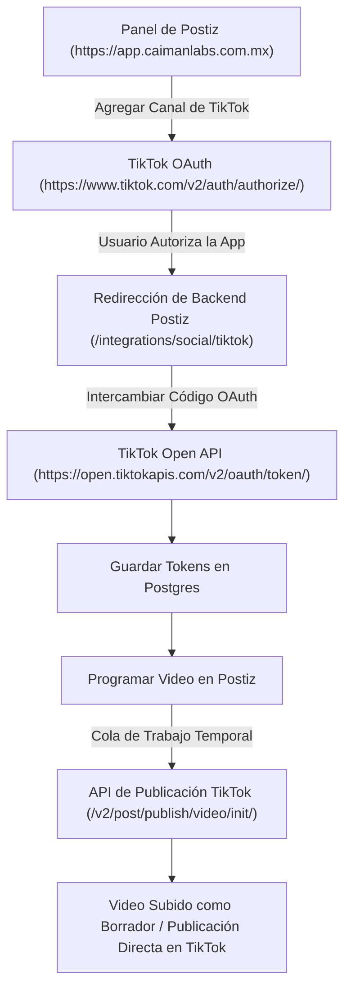

Este documento detalla la arquitectura end-to-end, configuración de pruebas en Modo Sandbox, integración con Postiz, matriz de permisos OAuth y resolución de errores para **Cuentas de TikTok** (`@caimanlabs`).

---

## 1. Visión General de la Arquitectura

---

## 2. Metadatos de la App y Credenciales

- **Cuenta de TikTok**: `@caimanlabs` (`socialmedia@caimanlabs.com.mx`)
- **Nombre de la App de Desarrollador**: `cAIman Labs Social`
- **Client Key (`TIKTOK_CLIENT_ID`)**: `aws3qu7gpfxx1k32`
- **URIs de Redirección Login Kit**:
  - `https://app.caimanlabs.com.mx/integrations/social/tiktok`
  - `https://postiz.11061996.xyz/integrations/social/tiktok`
- **URL Callback de Webhooks**: `https://api.caimanlabs.com.mx/webhook/facebook-comments`

---

## 3. Matriz de Permisos Scopes OAuth

Postiz requiere **6 scopes específicos** para funcionar correctamente con TikTok:

| Scope | Categoría | Propósito |
| :--- | :--- | :--- |
| `user.info.basic` | Login Kit | Lee información básica del perfil (open_id, avatar, nombre) |
| `user.info.profile` | Login Kit | Lee la biografía y metadatos del perfil |
| `user.info.stats` | Login Kit | Obtiene analíticas de seguidores, likes y conteo de videos |
| `video.upload` | Content Posting API | Sube archivos de video a borradores |
| `video.publish` | Content Posting API | Publica contenido directamente en perfiles autorizados |
| `video.list` | Display API / Content Posting API | Obtiene la lista de videos publicados para interacción y analíticas |
