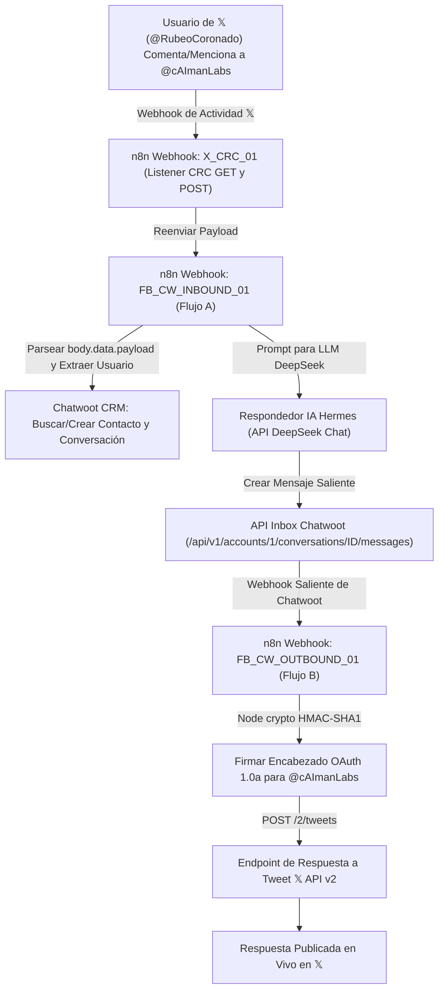

Este documento detalla la arquitectura completa end-to-end, configuración en X Developer App, integración con Postiz, automatización con n8n, CRM Chatwoot y la solución técnica para implementar respuestas automáticas con IA en **Cuentas de 𝕏** (`@caimanlabs`).

---

## 1. Arquitectura End-to-End

---

## 2. Metadatos y Credenciales

- **Cuenta de 𝕏**: `@cAImanLabs` (`User ID: 2082229569545981952`)
- **Nombre de la App de Desarrollador**: `cAlmanLabsAppPostiz`
- **Permisos de la App**: `Read and write and Direct message`
- **URL de Redirección / Callback**: `https://app.caimanlabs.com.mx/integrations/social/x`
- **Endpoint Webhook n8n**: `https://api.caimanlabs.com.mx/webhook/x-crc-comments`

---

## 3. Verificación Empírica

- **Comentario Probado**: El usuario `@RubeoCoronado` comentó en la publicación `2084433216690118735`:  
  > *"What is CaimanLabs?, I am interested"* ([Ver Comentario](https://x.com/RubeoCoronado/status/2084501419235668039))
- **Respuesta Publicada por Hermes AI**: Tweet ID `2084502457934033068`  
  > *"@RubeoCoronado cAIman Labs is an AI innovation studio crafting smart, human-centric solutions. We blend research and real-world tools—think intuitive agents, data insights, and creative tech. Glad you're interested! What area sparks your curiosity?"*  
- **Enlace a la Respuesta en Vivo**: [https://x.com/cAImanLabs/status/2084502457934033068](https://x.com/cAImanLabs/status/2084502457934033068)
