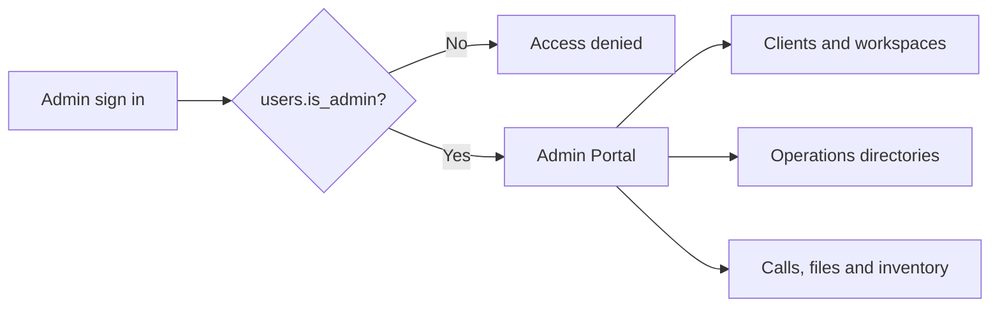

The Admin Portal is the operations application at `https://caimanlabs.com.mx/admin/`. It shares PocketBase with Client Portal but is limited to authenticated application users with `users.is_admin = true`.

## Access model



The PocketBase hook prevents normal users from promoting themselves. Administrators should be assigned deliberately in PocketBase; a Client Portal browser must never receive a PocketBase superuser credential.

## Navigation and responsibilities

| Section | What the administrator can inspect |
| --- | --- |
| Clients | Client/business summary, plan, billing, storage, status and contextual management entry point. |
| Users | Actual application accounts that authenticate through email/password or OAuth. A client may have multiple users in the future. |
| Agents | Agents grouped by client; search, filters, visible columns and drill-down details. |
| Social channels | Channels grouped by client, including active platform logos and integrated-channel details. |
| Calls | Support appointments scheduled by clients. |
| Inventory | Client list first; then the same editable inventory table used in Client Portal. |
| Files | Client list first; then a full client file workspace with upload, search, selection and actions. |
| Client workspace | Breadcrumb-based, client-specific view of profile, business data, onboarding stages, billing and other allowed operational details. |

## Shared data, separate responsibilities

Admin Portal does not maintain a duplicate database. It reads and updates the same PocketBase collections as Client Portal, with `is_admin` access rules where operational work requires it.

- Client updates are immediately reflected in the administrator’s workspace.
- Client support appointments appear in the Calls section.
- Inventory and files retain the same column definitions and records in both portals.
- The implementation plan is read from `integration_steps`, not recreated in the Admin UI.

## Localization and build configuration

The Admin Portal supports Spanish, English and Portuguese independently of Client Portal. Its browser session and language state use distinct storage keys so the two apps do not replace one another.

For production, build it with:

```text
VITE_POCKETBASE_URL=https://api.caimanlabs.com.mx
base: "/admin/"
```

See the [Client Portal Production Runbook](./client-portal-production/) for the shared deployment sequence. Both portal builds are required for every release.
