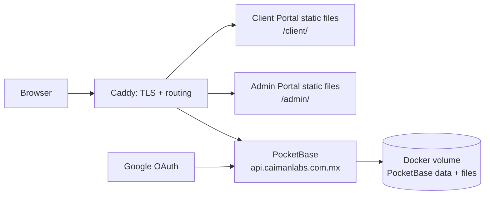

This is the production handoff for the client portal, admin portal, API and Google sign-in. It deliberately uses a small, self-hosted stack suitable for the current number of clients.

> **Deployment scope:** this is a single release with three deliverables: the Client Portal, the Admin Portal and PocketBase. Deploying only the Client Portal is incomplete.

## Target architecture

| Public address | Service | Source repository |
| --- | --- | --- |
| `https://caimanlabs.com.mx/client/` | Client Portal (React/Vite static build) | `cAImanLabs-ClientPortal` |
| `https://caimanlabs.com.mx/admin/` | Admin Portal (React/Vite static build) | `cAImanLabs-AdminPortal` |
| `https://api.caimanlabs.com.mx` | PocketBase API, admin dashboard and file API | `cAImanLabs-ClientPortal` (`Dockerfile`, `pb_migrations`, `pb_hooks`) |

The company website may continue serving `/`. The two portals must be mounted below `/client/` and `/admin/`; they are not separate public domains.



## Required stack

- **Ubuntu 24.04 OVH VPS** — host OS.
- **Docker Engine and Docker Compose plugin** — PocketBase container and persistent storage.
- **Caddy 2** — reverse proxy, automatic HTTPS certificates and static-file server.
- **PocketBase 0.39.10** — authentication, database, files, migrations and hooks.
- **React 19 + Vite 8** — build-time only; the generated static files are served by Caddy.
- **Google OAuth 2.0 Web application** — client login.
- **GitHub deploy key** — read-only access to the three private/public repositories. Do not use a personal access token in shell history or deployment files.

No managed database, Kubernetes, Node process manager, Redis, or paid hosting is needed for this first production release.

## VPS paths

Create these directories on the VPS as `ubuntu`:

```text
/srv/caimanlabs/
├── client-portal/                 # clone: cAImanLabs-ClientPortal
├── admin-portal/                  # clone: cAImanLabs-AdminPortal
├── releases/
│   ├── client/                    # current built Client Portal files
│   └── admin/                     # current built Admin Portal files
├── pocketbase/                    # PocketBase compose project and .env
│   ├── compose.yml
│   └── backups/
└── caddy/
    └── Caddyfile
```

Use a named Docker volume, for example `caimanlabs_pocketbase_data`, for `/pb/pb_data`. It contains the PocketBase SQLite database and uploaded client files; it is not disposable.

## One-time server preparation

1. Point these DNS records to the OVH VPS IP:

   - `caimanlabs.com.mx`
   - `api.caimanlabs.com.mx`

2. Install Docker Engine, Docker Compose plugin and Caddy 2.
3. Permit only ports `22`, `80` and `443` in OVH/UFW. Do **not** expose PocketBase port `8090` publicly.
4. Create a GitHub deploy key with read-only access and clone the repositories into `/srv/caimanlabs/`.
5. Create `/srv/caimanlabs/pocketbase/.env` with a unique 32-character `PB_ENCRYPTION_KEY`. Restrict it to the deployment user (`chmod 600`). Never commit it.

## PocketBase production compose file

Create `/srv/caimanlabs/pocketbase/compose.yml`:

```yaml
services:
  pocketbase:
    build:
      context: ../client-portal
      dockerfile: Dockerfile
    restart: unless-stopped
    environment:
      PB_ENCRYPTION_KEY: ${PB_ENCRYPTION_KEY:?Set PB_ENCRYPTION_KEY in .env}
    ports:
      - "127.0.0.1:8090:8090"
    volumes:
      - caimanlabs_pocketbase_data:/pb/pb_data
      - ../client-portal/pb_hooks:/pb/pb_hooks:ro
      - ../client-portal/pb_migrations:/pb/pb_migrations:ro

volumes:
  caimanlabs_pocketbase_data:
```

Start it with:

```bash
cd /srv/caimanlabs/pocketbase
docker compose -f compose.yml up -d --build
```

Check it only locally on the server:

```bash
curl http://127.0.0.1:8090/api/health
```

Create the first PocketBase superuser from inside this exact Compose project. Do not run the command against another local PocketBase instance or volume:

```bash
docker compose -f compose.yml exec pocketbase \
  /pb/pocketbase superuser upsert admin@caimanlabs.com.mx 'CHOOSE-A-NEW-LONG-PASSWORD'
```

## Caddy routing

Create `/srv/caimanlabs/caddy/Caddyfile`. Adapt the existing `/` handler if the company website is already served by another application.

```txt
caimanlabs.com.mx {
    encode zstd gzip

    redir /client /client/ 308
    handle_path /client/* {
        root * /srv/caimanlabs/releases/client
        try_files {path} /index.html
        file_server
    }

    redir /admin /admin/ 308
    handle_path /admin/* {
        root * /srv/caimanlabs/releases/admin
        try_files {path} /index.html
        file_server
    }

    # Keep or replace with the existing company-site handler for /.
    handle {
        respond "cAImanLabs company site is configured separately" 404
    }
}

api.caimanlabs.com.mx {
    encode zstd gzip
    reverse_proxy 127.0.0.1:8090
}
```

Validate and reload after every change:

```bash
sudo caddy validate --config /srv/caimanlabs/caddy/Caddyfile
sudo systemctl reload caddy
```

## Build and release portals

Before building, the deployer must set Vite's public base path. This is currently a required production change because both portals are mounted beneath a path.

```ts
// vite.config.ts — Client Portal
export default defineConfig({ base: "/client/" })

// vite.config.ts — Admin Portal
export default defineConfig({ base: "/admin/" })
```

Build each portal with its production API URL:

```bash
cd /srv/caimanlabs/client-portal
printf 'VITE_POCKETBASE_URL=https://api.caimanlabs.com.mx\n' > .env.production.local
npm ci
npm run build
rsync -a --delete dist/ /srv/caimanlabs/releases/client/

cd /srv/caimanlabs/admin-portal
printf 'VITE_POCKETBASE_URL=https://api.caimanlabs.com.mx\n' > .env.production.local
npm ci
npm run build
rsync -a --delete dist/ /srv/caimanlabs/releases/admin/
```

`VITE_POCKETBASE_URL` is public configuration. Do not place Google secrets or `PB_ENCRYPTION_KEY` in it.

### Required release order — both portals

Use this order on every release so the API schema and both UIs stay compatible:

```bash
# 1. Update both application repositories.
git -C /srv/caimanlabs/client-portal pull --ff-only
git -C /srv/caimanlabs/admin-portal pull --ff-only

# 2. Apply PocketBase migrations and hooks from Client Portal.
cd /srv/caimanlabs/pocketbase
docker compose -f compose.yml up -d --build

# 3. Build + publish Client Portal to /client/.
cd /srv/caimanlabs/client-portal
npm ci && npm run build
rsync -a --delete dist/ /srv/caimanlabs/releases/client/

# 4. Build + publish Admin Portal to /admin/.
cd /srv/caimanlabs/admin-portal
npm ci && npm run build
rsync -a --delete dist/ /srv/caimanlabs/releases/admin/

# 5. Activate routes and verify both URLs.
sudo systemctl reload caddy
```

The Admin Portal uses the same PocketBase instance, but it is an independently built frontend. Its build must also receive `VITE_POCKETBASE_URL=https://api.caimanlabs.com.mx` and `base: "/admin/"`.

## Google OAuth

1. In Google Cloud Console, create a **Web application** OAuth client.
2. Add this authorized redirect URI:

   ```text
   https://api.caimanlabs.com.mx/api/oauth2-redirect
   ```

3. Add `https://caimanlabs.com.mx` as an authorized JavaScript origin.
4. In PocketBase dashboard, go to **Collections → users → collection gear → OAuth2**, enable Google and save the Google Client ID and Client Secret.
5. The frontend already calls `pb.collection("users").authWithOAuth2({ provider: "google" })`.

### Required phone-field decision

`users.phone` is required. A first-time Google sign-in will fail unless a phone value is supplied during OAuth record creation. Before enabling Google sign-in, implement a short phone step before the Google button and call:

```ts
await pb.collection("users").authWithOAuth2({
  provider: "google",
  createData: { phone },
})
```

On a successful sign-in PocketBase creates the `users` record, which makes it available to the Admin Portal user table. The existing PocketBase hooks then create the associated business/onboarding records.

## Client Data MCP for agents

The Client Portal repository includes a local MCP server at `mcp/`. It is the only supported agent path for reading or publishing client data; agents must not receive direct PocketBase dashboard credentials or unrestricted database access.

It exposes five constrained tools:

- `list_clients` and `get_client_context` for approved client context;
- `publish_client_information` for allowed profile, information and website fields;
- `publish_client_progress` for an existing onboarding step;
- `publish_client_file` for a local, approved file.

The server runs over **stdio** with no public port. Install it on the VPS and keep its environment file private:

```bash
cd /srv/caimanlabs/client-portal/mcp
npm ci
cp .env.example .env
chmod 600 .env
mkdir -p /srv/caimanlabs/mcp-uploads
```

Set `MCP_POCKETBASE_URL=https://api.caimanlabs.com.mx`, a dedicated PocketBase superuser email/password, and `MCP_UPLOAD_DIR=/srv/caimanlabs/mcp-uploads` in that `.env`. Configure the agent host to launch `npm start` from this directory. The MCP tool only accepts uploads inside `MCP_UPLOAD_DIR`, does not expose OAuth tokens, and does not provide raw database queries.

## Deployment and verification checklist

1. Pull the intended Git commits in the **two** portal repositories.
2. Back up PocketBase before schema changes.
3. Run `docker compose -f /srv/caimanlabs/pocketbase/compose.yml up -d --build` and inspect logs.
4. Build and sync both static portals.
5. Reload Caddy.
6. Verify all of the following:

   - `https://caimanlabs.com.mx/client/` loads and refreshes on an internal route.
   - `https://caimanlabs.com.mx/admin/` loads and refreshes on an internal route.
   - `https://api.caimanlabs.com.mx/_/` is reachable only through HTTPS.
   - email/password sign-in works;
   - Google sign-in creates one record in PocketBase `users` and it appears in Admin Portal;
   - a client file upload persists after `docker compose restart`.

## Backup and recovery

Create a daily encrypted/off-server backup of the PocketBase Docker volume. At minimum, copy the PocketBase database and files from the running volume to `/srv/caimanlabs/pocketbase/backups/`, then replicate that directory to separate storage. Test a restore on a non-production volume before relying on it.

The deployment is incomplete until backup and restore have been tested.
