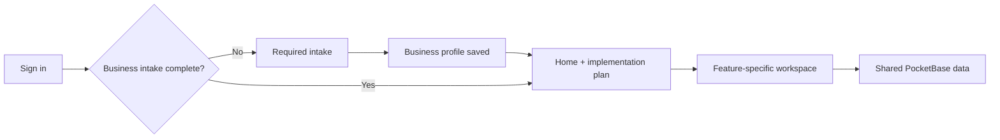

The Client Portal is the business-facing application at `https://caimanlabs.com.mx/client/`. It lets one authenticated user set up their business, provide implementation context and track delivery.

## User journey



1. The client signs in with email/password or Google.
2. A new `users` record creates one `businesses` record, a default billing record and initial onboarding steps.
3. The intake is mandatory. Navigation remains unavailable until `intake_completed_at` is stored.
4. The selected business functionalities determine which workspace sections appear.

## Main sections

| Section | Purpose | Availability |
| --- | --- | --- |
| Home (`Inicio`) | Business summary, selected channels, agent/website state, current implementation stages and pending work. | Always after intake |
| Progress (`Progreso`) | Plan-first onboarding view backed by `integration_steps`. | Always |
| Agents | WhatsApp Business, website chat, phone calls and media-generation agent states. | When an agent functionality is selected |
| Social Media | Select, connect and provide context for the client’s active channels. | `social_integration` |
| Website | Structured requirements for the selected website type. | `website` |
| Inventory | Editable catalog, custom columns, product variants and CSV import/export. | `catalog_sales` |
| Reservations | Configurable resources, prices, currency and booking method. | `reservations` |
| Images & videos / Files | Upload media assets and business files with clear purpose/section metadata. | Always |
| Information | Objectives, mission, slogans, prices, inspiration references and additional content modules. | Always |
| Support | Support context and client call scheduling. | Always |
| Billing | Plan, renewal, invoices and payment information. | Always |
| Settings | User profile and separate business-functionality controls with explicit save confirmation. | Always |

## Feature-driven navigation

The portal does not use a fixed menu. `businesses.functionalities` controls the menu and implementation plan:

- `chat_agent`, `wa_business`, `phone_calls_agent`, `social_media_generation_agent` unlock **Agents**.
- `social_integration` unlocks **Social Media** and social onboarding stages.
- `website` unlocks **Website** and its demo stage.
- `catalog_sales` unlocks **Inventory**.
- `reservations` unlocks **Reservations**.
- `reports` adds report-related delivery stages.

Removing a functionality removes the dependent navigation and recalculates applicable implementation stages; it does not expose unrelated data.

## Authentication and language

- PocketBase owns authentication and the browser stores the portal session locally under a Client Portal-specific key.
- The Google button uses PocketBase OAuth2 against the `users` auth collection. Because `users.phone` is required, the OAuth onboarding must collect a phone and pass it as OAuth `createData` before enabling first-time sign-up.
- Spanish, English and Portuguese are supported. The language choice is persisted locally and applies to the portal shell and content.

## Data ownership

Each client-facing record is linked to a business. PocketBase rules restrict normal users to records where `business.owner` matches the authenticated user. Client-side UI visibility is helpful, but PocketBase rules are the security boundary.

## Local development

```bash
cd cAImanLabs-ClientPortal
npm ci
npm run dev
```

Set `VITE_POCKETBASE_URL` to the intended PocketBase endpoint. For production details, use the [Client Portal Production Runbook](./client-portal-production/).
