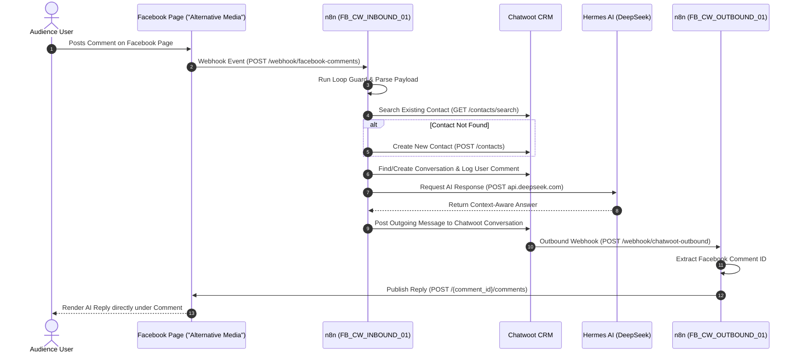

This document provides a high-level system overview of the cAIman Labs automated social media publishing, AI customer engagement, CRM management, and webhook orchestration platform.

---

## 1. System Components & Domains

| Service | Subdomain / URL | Namespace | Primary Function |
| :--- | :--- | :--- | :--- |
| **Postiz** | `https://postiz.11061996.xyz` | `postiz` | Multi-channel social media publishing & scheduling platform |
| **Chatwoot** | `https://chatwoot.11061996.xyz` | `chatwoot` | Centralized customer engagement & comment support CRM |
| **n8n Engine** | `https://n8n.11061996.xyz` | `api-operations` | Event orchestration, webhook transformation & pipeline automation |
| **Hermes AI** | `https://hermes.11061996.xyz` | `ai-agent` | AI Agent engine powered by DeepSeek LLM models |
| **Facebook Pages** | `Graph API v20.0` | External | Social media audience channels (Page: `Alternative Media`) |

---

## 2. End-to-End Pipeline Data Flow

---

## 3. Kubernetes Network Topology

- **Ingress Controller**: NGINX Ingress Controller routing HTTPS traffic via TLS certificates.
- **Cluster Networking**:
  - `n8n` communicates with `Chatwoot` over internal K8s Service DNS: `http://chatwoot-web.chatwoot:3000`.
  - `n8n` calls `DeepSeek API` directly over HTTPS (`https://api.deepseek.com/v1/chat/completions`).
  - `Postiz` communicates with `postiz-postgres:5432`, `postiz-redis:6379`, and `temporal:7233` within the `postiz` namespace.

---

## 4. Security & Cryptomator Secret Vault

All sensitive API keys, database credentials, JWT secrets, and OAuth access tokens are stored securely outside git in the Cryptomator encrypted vault:
- **Mounted Path**: `/Volumes/Environments-Keys`
- **Master Reference**: `/Volumes/Environments-Keys/MASTER_ENVIRONMENT_KEYS.md`
- **Secrets Included**:
  - `facebook_pages.env` (Meta App ID, Page ID, Permanent Access Token, Webhook Verify Token)
  - `chatwoot.env` (Chatwoot API Token, Account ID, Inbox ID)
  - `hermes_ai.env` (DeepSeek API Key, DeepInfra Key, Bot Tokens)
  - `postiz.env` (Database URL, Redis URL, JWT Secret)
  - `n8n.env` (Trust Proxy settings, Webhook Base URL)
