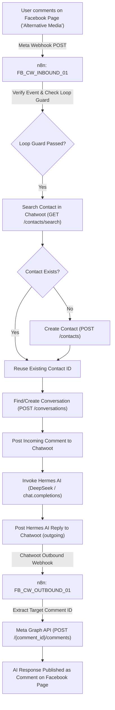

This document details the end-to-end architecture, configuration, n8n workflows, Chatwoot CRM integration, and Hermes AI agent integration for Facebook Pages.

---

## 1. Architecture Overview



---

## 2. Facebook App & Page Metadata

- **App Name**: `Testing Postiz Working`
- **App ID**: `1462110212613281`
- **App Mode**: Development / Business
- **Target Page**: `Alternative Media`
- **Page ID**: `107444744207055`
- **Subscribed Fields**: `feed`, `messages`, `ratings`
- **Webhook Endpoint**: `https://api.caimanlabs.com.mx/webhook/facebook-comments`
- **Verify Token**: Configured in secret vault

---

## 3. Webhook Setup & Page Subscription

### Step A: Configure Webhook Endpoint in Meta Developer Console
1. Navigate to **Meta Developer Console** $\rightarrow$ **Webhooks** $\rightarrow$ **Page**.
2. Set Callback URL: `https://api.caimanlabs.com.mx/webhook/facebook-comments`
3. Set Verify Token: `{VERIFY_TOKEN}`
4. Verify & Save.

### Step B: Subscribe Facebook Page to Webhooks via Graph API
Run the Graph API subscription call to link the page:
```bash
curl -X POST "https://graph.facebook.com/v20.0/107444744207055/subscribed_apps?subscribed_fields=feed,messages&access_token={PAGE_ACCESS_TOKEN}"
```
*Expected Response:* `{"success": true}`

---

## 4. Token Management & Expiration Strategy

### Token Types & Life Cycles
- **Short-Lived Page Token**: Expires in 1–2 hours (generated in Graph API Explorer).
- **Long-Lived User Token**: Lasts 60 days.
- **Permanent Page Access Token**: **Never expires** (Expiry: `Never`).

### How to Generate a Permanent Page Token
1. Exchange your short-lived User Token for a 60-day User Token:
   ```bash
   GET https://graph.facebook.com/v20.0/oauth/access_token?grant_type=fb_exchange_token&client_id={APP_ID}&client_secret={APP_SECRET}&fb_exchange_token={SHORT_LIVED_USER_TOKEN}
   ```
2. Request your Page Access Token using the 60-day User Token:
   ```bash
   GET https://graph.facebook.com/v20.0/107444744207055?fields=access_token&access_token={LONG_LIVED_USER_TOKEN}
   ```
   *The returned `access_token` has an expiration of `Never`.*

---

## 5. Inbound Workflow (`FB_CW_INBOUND_01`)

The inbound workflow (`n8n-workflows/facebook_chatwoot_inbound_hermes.json`) performs:

1. **Meta Webhook Verification (GET)**: Handles `hub.mode=subscribe` challenge verification.
2. **Event Parsing & Normalization**: Extracts `comment_id`, `post_id`, `user_id`, `user_name`, and `comment_text`.
3. **Loop Guard**: Ignores comments authored by the Page itself (`from.id === FB_PAGE_ID`).
4. **Contact Search Before Creation**: Runs `GET /api/v1/accounts/2/contacts/search?q={user_id}` to check if the user already exists. Reuses `contact_id` for existing users, eliminating HTTP 422 (`Identifier has already been taken`) errors.
5. **Conversation Management**: Finds or creates the active Chatwoot conversation for the user.
6. **Hermes AI Response Generation**: Calls DeepSeek model (`POST https://api.deepseek.com/v1/chat/completions`) with context-aware prompt instructions.
7. **Chatwoot Outgoing Message Creation**: Posts the AI answer to Chatwoot conversation (`message_type: "outgoing"`).

---

## 6. Outbound Workflow (`FB_CW_OUTBOUND_01`)

The outbound workflow (`n8n-workflows/facebook_chatwoot_outbound.json`) performs:

1. **Chatwoot Outbound Webhook Listener**: Listens on `https://api.caimanlabs.com.mx/webhook/chatwoot-outbound`.
2. **Comment ID Extraction**: Extracts target Facebook `comment_id` from `body.content_attributes.facebook_comment_id` or falls back to `body.conversation.contact_inbox.source_id`.
3. **Meta Graph API Reply**: Executes `POST https://graph.facebook.com/v20.0/{facebook_comment_id}/comments` with `message={content}`.
4. **Error Handling & Private Notes**: If Meta API fails, posts a private warning note inside the Chatwoot conversation.
