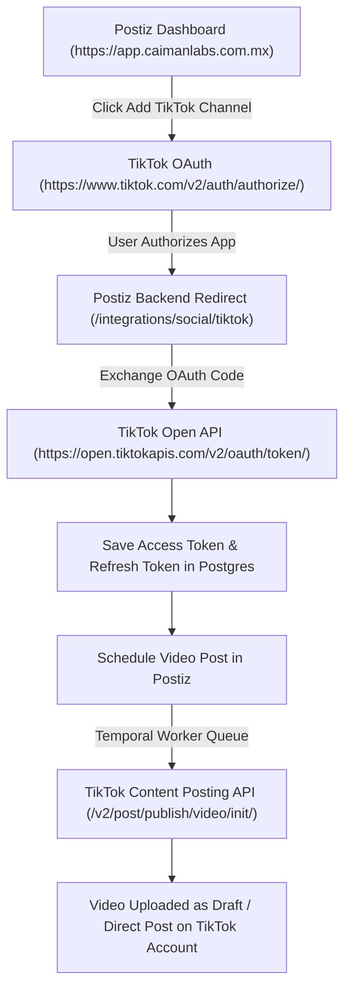

This document details the end-to-end architecture, Sandbox testing configuration, Postiz platform integration, required OAuth scopes, and technical troubleshooting for **TikTok Accounts** (`@caimanlabs`).

---

## 1. Architecture Overview

---

## 2. Developer App Metadata & Credentials

- **TikTok Account**: `@caimanlabs` (`socialmedia@caimanlabs.com.mx`)
- **Developer App Name**: `cAIman Labs Social`
- **Client Key (`TIKTOK_CLIENT_ID`)**: `aws3qu7gpfxx1k32`
- **Login Kit Redirect URIs**:
  - `https://app.caimanlabs.com.mx/integrations/social/tiktok`
  - `https://postiz.11061996.xyz/integrations/social/tiktok`
- **Webhooks Callback URL**: `https://api.caimanlabs.com.mx/webhook/facebook-comments`

---

## 3. Product Kits & Configuration Checklist

| Product Kit | Status | Configuration & Purpose |
| :--- | :--- | :--- |
| **Login Kit** | ✅ KEEP | Redirect URI: `https://app.caimanlabs.com.mx/integrations/social/tiktok` |
| **Content Posting API** | ✅ KEEP | Direct Post & Draft Uploads (`video.upload`, `video.publish`) |
| **Webhooks** | ✅ KEEP | Callback URL: `https://api.caimanlabs.com.mx/webhook/facebook-comments` |
| **Local Service API** | 🗑️ DELETE | Remove via Trash icon (Causes physical shop scope audit rejection) |
| **Share Kit** | ❌ OMIT | Not required for Postiz web integration |
| **Data Portability API** | ❌ OMIT | Not required for Postiz web integration |

---

## 4. How TikTok Sandbox Mode Works

1. **Target Users Authorization**:
   - In Sandbox Mode, TikTok restricts login access strictly to accounts explicitly listed under **Sandbox settings $\rightarrow$ Target Users** (e.g. `@caimanlabs`).
   - The target account user must accept the sandbox developer invitation in the TikTok mobile app (**Inbox $\rightarrow$ System Notifications**).

2. **Draft Mode vs Live Posting**:
   - In Sandbox Mode, videos published via Postiz are uploaded to the authorized TikTok account as **Private Drafts**.
   - You will receive a mobile push notification: *"Your video is ready in your Drafts"*.
   - The video is **only visible to you** inside your TikTok phone app Drafts tab.
   - To make the video public on `@caimanlabs`, open the draft in the phone app and tap **Post** (or record a screen capture video of this process to submit for live app approval).

---

## 5. Required OAuth Scopes Matrix

Postiz requires **6 specific scopes** to function properly with TikTok:

| Scope | Category | Purpose in Postiz |
| :--- | :--- | :--- |
| `user.info.basic` | Login Kit | Reads basic user profile info (open_id, avatar, display_name) |
| `user.info.profile` | Login Kit | Reads bio description and profile metadata |
| `user.info.stats` | Login Kit | Fetches account follower count, likes count, and video count analytics |
| `video.upload` | Content Posting API | Uploads video files to creator account drafts |
| `video.publish` | Content Posting API | Directly publishes video content to authorized profiles |
| `video.list` | Display API / Content Posting API | Lists published videos for engagement & analytics tracking |

---

## 6. Technical Discoveries & Errors Solved

### 💡 Discovery 1: OAuth `scope` Error during Channel Authorization
- **Symptom**: When attempting to log in via Postiz, TikTok displayed error:  
  `Something went wrong. We couldn't log in with TikTok. This may be due to specific app settings: scope`.
- **Root Cause**: Postiz explicitly requests `video.list` in the OAuth authorization query parameter (`&scope=video.list,user.info.basic...`). If `video.list` is missing from the Developer App scopes, TikTok rejects the authorization request.
- **Solution**: Enabled **`video.list`** under **Scopes** in the TikTok Developer Console.

### 💡 Discovery 2: Redirect URI "404 Not Found" on Test Event
- **Symptom**: Clicking "Test event" on the Redirect URI (`https://app.caimanlabs.com.mx/integrations/social/tiktok`) returned `404 Not Found`.
- **Root Cause**: The Developer Console "Test event" button sends HTTP `POST` requests intended for **Webhooks**. Redirect URIs are browser-based OAuth URLs expecting HTTP `GET` redirects with `code` and `state` parameters.
- **Solution**: Saved the Redirect URI in the developer console without clicking the "Test event" button.

### 💡 Discovery 3: App Not Approved for Public Posting
- **Symptom**: Postiz container logs threw `ApplicationFailure: App not approved for public posting, contact support`.
- **Root Cause**: Unapproved Sandbox apps cannot post directly to `Public to Everyone`.
- **Solution**: Set Posting Method to `Upload content as draft` or Privacy Level to `Self Only` during Sandbox testing.

### 💡 Discovery 4: Ingress Upload Size Restriction
- **Symptom**: Uploading 75 MB video files stuck at 2% indefinitely.
- **Root Cause**: Nginx Ingress default body size limit was 1 MB (`client_max_body_size`).
- **Solution**: Updated `postiz-ingress` with `nginx.ingress.kubernetes.io/proxy-body-size: "500m"`.
