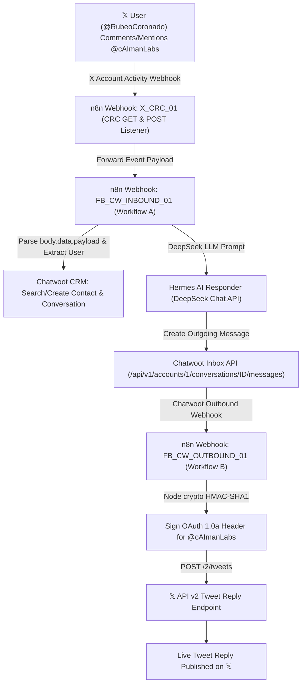

This document details the complete end-to-end architecture, X Developer App configuration, Postiz platform integration, n8n webhook automation, Chatwoot CRM connection, and the technical journey/troubleshooting behind implementing live automated AI replies on **𝕏 Accounts** (`@caimanlabs`).

---

## 1. End-to-End Architecture

---

## 2. Developer App Metadata & Credentials

- **𝕏 Account**: `@cAImanLabs` (`User ID: 2082229569545981952`)
- **Developer App Name**: `cAlmanLabsAppPostiz`
- **App Permissions**: `Read and write and Direct message`
- **Type of App**: `Web App, Automated App or Bot`
- **Callback URI / Redirect URL**: `https://app.caimanlabs.com.mx/integrations/social/x`
- **n8n Webhook Endpoint**: `https://api.caimanlabs.com.mx/webhook/x-crc-comments`

---

## 3. The Technical Journey & Solved Issues

### 💡 1. Postiz OAuth 1.0a Consumer Keys vs OAuth 2.0 Client ID
- **Symptom**: Clicking **Add Channel $\rightarrow$ X** in Postiz returned `Could not connect to the platform`.
- **Root Cause**: Postiz uses Twitter API v2 with OAuth 1.0a 3-legged authentication (`client.generateAuthLink`), requiring **Consumer API Keys & Secrets** (`appKey`, `appSecret`). Using OAuth 2.0 Client IDs (strings ending in `:1:ci`) caused Twitter's `request_token` API to reject authorization.
- **Solution**: Used Consumer API Key & Secret under the **Keys and tokens** tab in X Developer Portal.

### 💡 2. Sharp Buffer Conversion Bug in Postiz Media Uploads
- **Symptom**: Publishing posts with attached images failed with `ApplicationFailure: Unknown Error at XProvider.uploadMedia`.
- **Root Cause**: Postiz's `x.provider.js` ran `sharp(buffer).resize({ width: 1000 }).gif().toBuffer()` on all image types (JPEG, PNG, WebP), forcing GIF formatting while supplying `media_type: image/png` or `image/jpeg` to Twitter's `client.v2.uploadMedia()`.
- **Solution**: Patched `x.provider.js` in backend and orchestrator services to pass clean raw buffers directly to Twitter's `uploadMedia` API.

### 💡 3. CRC Webhook Verification Requirement
- **Symptom**: Adding the n8n webhook URL to 𝕏 Developer Portal returned `CRC Check failed`.
- **Root Cause**: 𝕏 requires webhooks to respond to `GET` requests containing a `crc_token` parameter by calculating an HMAC-SHA256 hash using the `X_API_SECRET` and returning `{ "response_token": "sha256=..." }`.
- **Solution**: Built workflow `X_CRC_01` in n8n to listen on `GET /webhook/x-crc-comments`, compute `crypto.createHmac('sha256', secret).update(crcToken).digest('base64')`, and respond synchronously with HTTP 200.

### 💡 4. n8n 1-Port Node Dual-Branching Connection Syntax
- **Symptom**: Webhook events passed to `Parse & Normalize Payload` did not reach `Filter Event & Loop Guard`.
- **Root Cause**: In n8n workflow JSON, branching multiple downstream nodes from a single 1-port output MUST use a single inner array (`"main": [ [ { "node": "NodeA" }, { "node": "NodeB" } ] ]`). Using `[ [ { "node": "NodeA" } ], [ { "node": "NodeB" } ] ]` assigns NodeB to port 2 (which 1-port Code nodes do not have).
- **Solution**: Fixed JSON connection schema to place both targets inside the first array element.

### 💡 5. Chatwoot Contact Deduplication (`422 Identifier taken`)
- **Symptom**: Workflow halted at `Chatwoot Create Contact` for returning users with error `422 Identifier has already been taken`.
- **Root Cause**: Chatwoot rejects contact creation if a contact with the same `identifier` already exists.
- **Solution**: Replaced direct contact creation with `Chatwoot Search Contact` (`GET /api/v1/accounts/1/contacts/search?q={user_id}`) with `neverError: true`, ensuring returning contacts are resolved gracefully.

### 💡 6. 𝕏 API v2 Outbound OAuth 1.0a Authorization Signature
- **Symptom**: Outbound requests to `POST /2/tweets` failed with `401 Unauthorized` or `403 Unsupported Authentication` when sending plain Bearer tokens.
- **Root Cause**: 𝕏 API v2 `POST /2/tweets` requires **OAuth 1.0a User Authorization** headers containing `oauth_consumer_key`, `oauth_nonce`, `oauth_signature`, `oauth_token`, and `oauth_timestamp` signed with HMAC-SHA1.
- **Solution**: Added Node `crypto` code node `Sign OAuth 1.0a X Request` in `FB_CW_OUTBOUND_01` to dynamically construct and sign the OAuth 1.0a header.

### 💡 7. Real 𝕏 Webhook `body.data.payload` Wrapper Structure
- **Symptom**: Test payloads worked, but live real-world comments posted by users on 𝕏 triggered the webhook without generating replies.
- **Root Cause**: Real webhooks delivered by 𝕏 Developer Portal enclose the event inside `body.data.payload` (e.g. `{ data: { payload: { id, text, author_id, conversation_id }, includes: { users: [...] } } }`), whereas simulated test webhooks sent `body.data` directly. Attempting to parse `body.data.id` on real webhooks returned `undefined`, setting `isValidEvent = false`.
- **Solution**: Updated `Parse & Normalize Payload` to extract `const tweet = body.data?.payload || body.tweet_create_events?.[0] || body.data || {}` and `const users = body.data?.includes?.users || body.includes?.users || []`.

---

## 4. Empirical Verification

- **Live Comment Tested**: User `@RubeoCoronado` commented on post `2084433216690118735`:  
  > *"What is CaimanLabs?, I am interested"* ([View Comment](https://x.com/RubeoCoronado/status/2084501419235668039))
- **Live Hermes AI Reply Published**: Tweet ID `2084502457934033068`  
  > *"@RubeoCoronado cAIman Labs is an AI innovation studio crafting smart, human-centric solutions. We blend research and real-world tools—think intuitive agents, data insights, and creative tech. Glad you're interested! What area sparks your curiosity?"*  
- **Live Reply Link**: [https://x.com/cAImanLabs/status/2084502457934033068](https://x.com/cAImanLabs/status/2084502457934033068)
